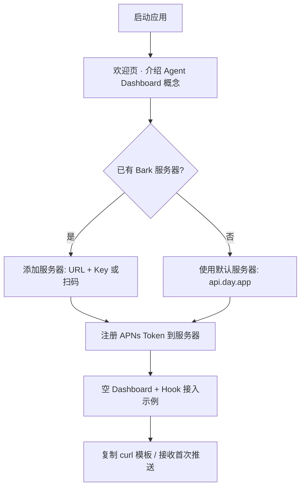
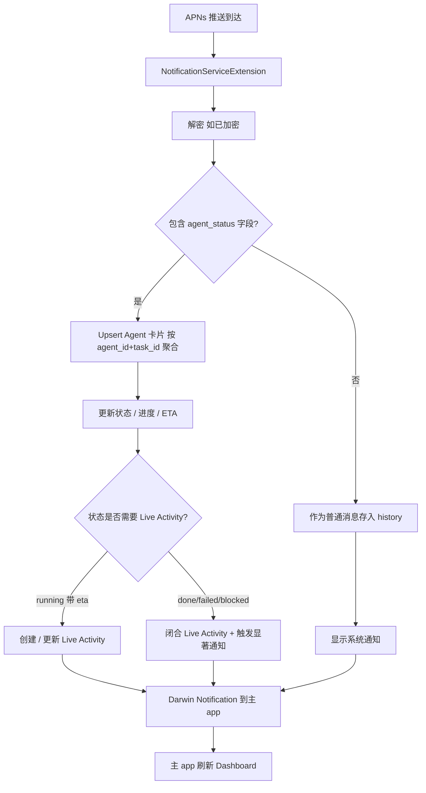
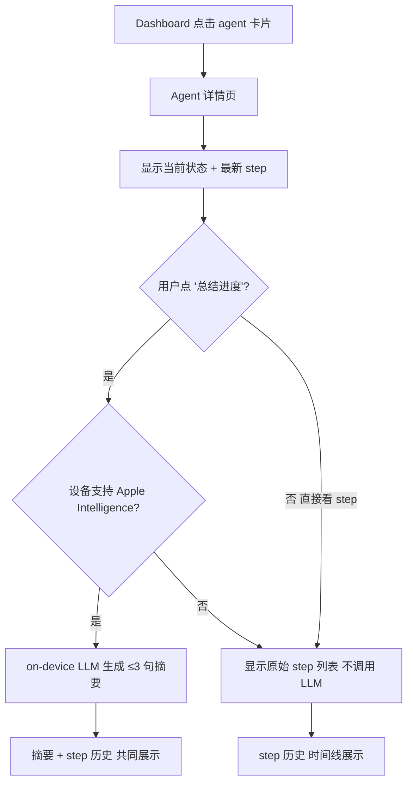

# BarkAgent — 产品规格说明

> 版本: 0.3.0 | 日期: 2026-05-08 | 状态: Draft

## 1. 背景

### 问题

AI Agent（Claude Code、Codex、Cursor、自建 agent workflow 等）正在成为开发者日常生产力的核心。但这些 agent 往往**长时间运行在终端或后台**，开发者面临三个具体痛点：

- **状态不可见**：Agent 是在跑、在等输入、还是卡住了？除非主动切回终端，否则不知道。
- **进度看不到**：一个多步骤任务跑到第几步、还剩多少、当前在做什么——只能滚动一长串日志去找。
- **离开电脑就失联**：去开会、通勤、出门买咖啡，agent 在后台跑什么完全没感知，回来才发现早就卡在某个 confirm 提示上。

现有方案不够用：
- **Bark**：推送通道很成熟，但每条推送是孤立的消息，不聚合成"一个 agent 的状态"。开了 10 个 agent，timeline 里就是 100 条混乱的消息。
- **桌面通知**：只在电脑前有用，离开就失效。
- **Slack / Telegram bot**：能收推送但没有"agent 卡片"语义，需要自己心算"哪条是最新状态"。

### 机会

Agent 的生命周期天然是**状态机**（running / waiting / blocked / done / failed），而不是消息流。如果把推送通道（Bark 协议生态）和"持久 agent 卡片"语义结合，再叠加 iOS 端的本地 LLM 总结能力（Apple Intelligence），就能给开发者一个"口袋里的 agent dashboard"——隐私不出设备，状态一眼可见。

## 2. 产品愿景

**BarkAgent 是一个跑在 iOS 上的 AI Agent 状态面板。**

它做两件事：

1. **显示 agent 当前状态** —— 每个 agent / task 是一张持久卡片，状态原地更新（不堆积消息），主屏幕一眼看清"我有几个 agent 在跑，各自怎么样"
2. **总结 agent 任务进度** —— 设备端 LLM 把 agent 推过来的原始 step 日志压缩成人话："正在做第 3 / 7 步：编译失败，正在分析 stack trace"

设计原则：
- **隐私优先**：所有数据存设备本地，总结用 Apple Intelligence on-device，不上传不分析
- **Bark 协议兼容**：Agent 接入零门槛——任何能发 HTTP 的 agent / hook / CI 都能推
- **状态机优先于消息流**：UI 围绕"agent 状态"组织，不是"消息列表"

## 3. 目标

| 目标 | 衡量标准 |
|------|----------|
| Agent 状态一眼可见 | 主屏幕同屏可看到至少 6 个 active agent 的当前状态 |
| 接入零摩擦 | 已有 Bark hook 的 agent 无需改代码即可接收并归档为普通消息；带 `agent_status` 等新字段则升级为状态卡片 |
| 进度压缩可读 | 多步骤 task 的 step 历史可一键总结为 ≤3 句话的进度摘要 |
| 默认隐私 | 总结全部 on-device，除 APNs 注册和 Bark 服务器通信外无网络请求 |
| 离手感知 | 关键状态变化（blocked / failed / waiting_input）在锁屏 / Widget / Live Activity 可见 |

## 4. 非目标 (V1)

- **远程控制 agent**：BarkAgent 只读不写，不发送指令给 agent（V2 考虑双向通道）
- **Agent 编排 / workflow 设计**：不是 n8n 替代品，不画 DAG
- **跨设备同步**：所有数据本地（V2 考虑 iCloud 私有同步）
- **设备端存储加密**：依赖 iOS Data Protection，V2 上 SQLCipher
- **Android / iPad 专属布局**：仅 iOS iPhone（iPad 可用但不优化）
- **iOS 17 以下版本**
- **付费 / 订阅 / 账号系统**

## 5. 目标用户

### 主要用户：跑 AI Agent 的开发者

- 日常使用 Claude Code / Codex / Cursor / Aider / 自建 agent
- 在 agent 的 hook 系统（如 Claude Code 的 SessionStart / Stop / SubagentStop hook）里写过推送脚本
- 同时跑多个 agent / 多个任务，需要全局视图
- 离开电脑时仍希望感知 agent 状态
- 已经熟悉 Bark 或类似 HTTP 推送工具

### 次要用户：自动化爱好者 / CI 重度用户

- 跑 GitHub Actions / GitLab CI / 本地 cron / n8n workflow
- 希望把"长跑任务的状态"以卡片形式聚合到一个地方
- 之前用 Bark 接收 CI 通知，但苦于消息太散

## 6. 用户场景

### 场景 1：开发者 — 并行 agent 监控

林在终端同时跑了 4 个 Claude Code 会话：一个在重构后端、一个写测试、一个跑 e2e、一个查日志。每个会话的 SessionStart / Stop / Notification hook 都把状态推到 BarkAgent。她去会议室开会时打开 iPhone，看到 4 张 agent 卡片：

- `backend-refactor` · **running** · "正在改 auth.ts (3/8 文件)"
- `test-writer` · **waiting_input** · "请确认是否覆盖现有 mock"
- `e2e-runner` · **done** · "全部通过 (耗时 4m12s)"
- `log-analyzer` · **blocked** · "找不到 grafana token"

她点开 `test-writer`，看到展开的 step 历史 + 一句话总结，掏出电脑切回去回复一个 "yes"。

### 场景 2：CI 重度用户 — 长任务进度感知

Alex 的 monorepo 每次 deploy 要 25 分钟，CI 在不同阶段（lint / typecheck / build / test / migrate / deploy）各推一条 Bark 消息。在 BarkAgent 里，整个 deploy 是**一张卡片**，状态从 `running 1/6` 一直更新到 `done 6/6`，他在地铁上看一眼就知道现在到哪步、有没有挂。

### 场景 3：自建 agent workflow — 失败告警

李用 n8n 跑数据抓取 workflow，每个 node 是一个 step。某个 node 失败时 n8n 的 error hook 推一条 `agent_status=failed`，BarkAgent 立刻在主屏幕用红色高亮这张卡片，并触发 Live Activity 在锁屏上显示。他不用打开 app 就知道哪个 workflow 挂了。

## 7. 核心功能

### 7.1 Agent Dashboard（主屏幕）

**核心信息架构**——这是 BarkAgent 与传统消息收件箱最大的区别。

- **上半屏：Active Agents 卡片网格**
  - 每张卡片对应一个 `agent_id + task_id` 聚合
  - 显示：agent 名称、当前状态徽章（颜色编码）、最新 step 标题、进度（如 `3/7` 或 `45%`）、最后更新时间
  - 状态颜色：running 蓝 / waiting_input 黄 / blocked 橙 / done 绿 / failed 红
  - 长按卡片 → 操作菜单（归档 / 静音 / 标记完成）
  - 点击卡片 → 进入 Agent 详情页
- **下半屏：History Timeline**
  - 已完成 / 已归档的 agent task + 用户写的 Markdown 备忘录
  - 逆时间序、紧凑卡片
- **下拉刷新**：处理待归档的推送
- **顶部状态栏**：显示 `N running · M waiting · K blocked` 全局摘要

### 7.2 Agent 状态机模型

这是 V1 最关键的产品差异化点。

- **聚合规则**：相同 `agent_id + task_id` 的多次推送 → 更新同一张卡片，不堆消息
- **状态枚举**（来自推送字段 `agent_status`）：
  - `running` — 正在执行
  - `waiting_input` — 等待用户输入（如 confirm 提示）
  - `blocked` — 卡住（缺资源 / 缺 token / 依赖失败）
  - `done` — 成功完成
  - `failed` — 失败终止
- **状态转换**：客户端不强制状态机合法性，完全信任 agent 推送的状态值（agent 是事实来源）
- **超时降级**：超过 30 分钟没更新且状态为 `running` 的卡片 → 自动转为 `stale` 状态（视觉灰化），提醒用户 agent 可能已死
- **历史展开**：点开卡片 → 看到这个 task 的所有 step 推送（按时间序），即"这张卡片背后的原始消息流"

### 7.3 设备端进度总结

V1 用 Apple Intelligence Foundation Models API（iOS 18.1+）做总结。

- **触发时机**：用户点开 agent 卡片 → 展开历史时调用一次（不每次推送都跑，省电省算力）
- **输入**：该 task 的所有 step 推送的 title + body 拼接
- **输出**：≤3 句话的中文进度摘要 + 当前阻塞点（如果有）
- **降级策略**：不支持 Apple Intelligence 的设备（iOS 17 或老机型）→ 直接显示原始 step 列表，不调用 LLM
- **离线**：on-device 推理，完全离线可用
- **隐私**：所有 prompt 和 output 不出设备

### 7.4 Bark 协议兼容（传输层）

V1 完全复用 Bark 推送协议作为接入层，零成本生态兼容。

- Agent / hook 推送方式：`curl -X POST https://<bark-server>/<key> -d '...'`
- **字段映射**（向下兼容 Bark 老协议）：
  - `group` → `agent_id`（缺省则用 `default`）
  - `title` → 当前 step 名 / 状态描述
  - `body` → 详细 log
  - `url` → 可选的外链（如 CI 构建页）
  - `icon` → agent 图标
- **新增可选字段**（不带也能用，带了体验升级）：
  - `agent_status`: `running` / `waiting_input` / `blocked` / `done` / `failed`
  - `task_id`: 任务唯一 ID（多 task 并发时区分；缺省则按 `agent_id` 聚合）
  - `progress`: 字符串，如 `3/7` 或 `45%`
  - `eta`: ISO 时间戳，预计完成时间
- **协议降级**：不带新字段的推送 → 显示为普通消息卡片，落入下半屏 timeline（不影响存量 Bark 用户）
- **继承能力**（来自原 Bark）：
  - 密文解密（AES-128/192/256，CBC/ECB/GCM）
  - Markdown 渲染
  - 中断级别处理（active / timeSensitive / passive / critical）
  - Badge 管理 / 自动复制 / 分组静音 / 来电模式 / 图片附件 / 自定义图标
- **多服务器**：同时连接多个 Bark 服务器

### 7.5 Live Activity & 锁屏

iOS 16.1+ Live Activity / Dynamic Island 集成，让"在跑的 agent"成为锁屏一等公民。

- 状态为 `running` 且 ETA 已知的 task → 自动创建 Live Activity
- Dynamic Island 显示：agent 图标 + 进度 + 当前 step
- 状态变化到 `done` / `failed` / `blocked` / `waiting_input` → 触发显著通知 + Live Activity 闭合
- iOS 17+ ActivityKit 远程更新：Bark server 推送 push token 后，状态可远程推到 Live Activity

### 7.6 备忘录（次要功能，P1）

保留主动记录能力，作为 agent 监控的补充。

- 入口：history timeline 顶部的"+"按钮（不再是主屏 FAB——FAB 让位给 Agent 视图）
- Markdown 编辑器 + 预览
- 标签（行内 `#tag`）
- 照片 / 文件附件
- 出现在 history timeline，不进 Agent Dashboard

### 7.7 组织与检索

- **Agent 过滤**：按 agent_id / 状态 / 服务器 过滤 Dashboard
- **全文搜索**：跨 agent step 历史 + 备忘录的标题、正文、标签
- **置顶**：将重要 agent 卡片置顶
- **归档**：把已完成的 agent 卡片移出 Dashboard（进 history）

### 7.8 Widget

- **Active Agents Widget**（中 / 大）：主屏幕显示前 N 个 active agent 的状态徽章
- **状态摘要 Widget**（小）：显示全局 `N running · M waiting · K blocked` 计数
- **快速备忘录 Widget**（iOS 17+ Interactive）：一键新建备忘录
- **锁屏 Widget**：active agent 计数 + 状态摘要
- **控制中心 Widget**（iOS 18+）：快速备忘录入口

### 7.9 Share Extension

- 接收外部 app 共享的文本 / URL / 图片
- 保存为备忘录（不进 Agent Dashboard）

### 7.10 Siri / App Intents

- "在 BarkAgent 保存一条备忘"——语音创建备忘录
- "BarkAgent 有几个 agent 在跑"——查询 active agent 计数
- Shortcuts 集成

### 7.11 隐私与安全

- 数据存 SwiftData 应用沙箱
- iOS Data Protection（锁定时静态加密）
- 推送内容端到端加密（Bark AES，密钥本地）
- LLM 总结完全 on-device（Apple Intelligence Foundation Models）
- 无分析 / 无遥测 / 无数据收集
- 除 APNs 注册和 Bark 服务器通信外无网络请求
- V2：SQLCipher 数据库加密 + 生物识别锁

## 8. 信息架构

```
BarkAgent
├── Agent Dashboard (主 Tab)
│   ├── 全局状态摘要栏 (N running · M waiting · K blocked)
│   ├── Active Agents 卡片网格 (上半屏)
│   ├── History Timeline (下半屏: 已完成 agent + 备忘录)
│   └── 搜索栏 / 过滤
├── Agent 详情页 (从卡片进入)
│   ├── 当前状态 + 进度
│   ├── 设备端 LLM 摘要 (按需触发)
│   ├── Step 历史时间线 (原始推送展开)
│   └── 操作: 归档 / 静音 / 标记完成
├── 服务器 (设置子页)
│   ├── 服务器列表 + 状态
│   ├── 添加服务器 (URL / 二维码)
│   └── 每服务器密钥管理
└── 设置
    ├── 加密配置
    ├── 总结模型 (Apple Intelligence 开关 / 降级策略)
    ├── 通知偏好
    ├── 提示音管理
    ├── Stale 超时阈值 (默认 30 分钟)
    └── 关于 / 隐私
```

## 9. 用户流程

### 9.1 首次启动



### 9.2 接收 Agent 推送



### 9.3 查看 Agent 进度



## 10. V1 范围与优先级

### P0 — 必须有

- Agent Dashboard 主屏（卡片网格 + history timeline）
- Agent 状态机模型（聚合 / 状态枚举 / stale 超时）
- Bark 协议兼容接收（含新字段解析 + 老协议降级）
- 多服务器管理 + APNs 注册
- 推送端到端加密（Bark AES）
- Agent 详情页（step 历史展开）
- 置顶 / 归档 / 静音（Dashboard 卡片管理基础能力）
- 全文搜索
- 推送通知系统级展示

### P1 — 应该有

- 设备端 LLM 进度总结（Apple Intelligence）
- Live Activity + Dynamic Island
- Active Agents Widget + 状态摘要 Widget
- Markdown 备忘录（创建 / 编辑 / 标签）
- Share Extension

### P2 — 锦上添花

- Siri Shortcuts（查询 active 计数 / 创建备忘录）
- App Intents
- 导出（JSON / ZIP）
- 自定义提示音
- 二维码服务器配置

## 11. 路线图

| 版本 | 功能 |
|------|------|
| V1.0 | Agent Dashboard、状态机、Bark 兼容接收、Agent 详情页、搜索 |
| V1.1 | Apple Intelligence 设备端总结、Live Activity、Widget |
| V1.2 | 备忘录、Share Extension、Siri |
| V2.0 | 双向通道（向 agent 发指令）、SQLCipher 加密、iCloud 私有同步 |
| V2.x | 自定义 agent 模板、多 task 依赖图视图 |
| V3.0 | Apple Watch 伴侣（手腕看 agent 状态）、跨设备同步 |

## 12. 技术约束

- **iOS 17+** 最低部署目标；Apple Intelligence 相关特性要求 iOS 18.1+ + 支持机型，按 `@available` 自适应降级
- **SwiftUI + SwiftData**——不引入 UIKit / Realm / RxSwift
- **Swift Concurrency**——async/await、actor、strict sendability
- **Apple Intelligence Foundation Models API**（iOS 18.1+）做 on-device 摘要；不支持时降级为原始列表
- **ActivityKit**（iOS 16.1+，远程更新需 iOS 17+）做 Live Activity
- **最小依赖**——优先 Apple 框架而非第三方库
- **App Groups**——NSE ↔ 主 app 数据共享必需
- **模块化架构**——Swift Packages 组织 Models / Services / UI
