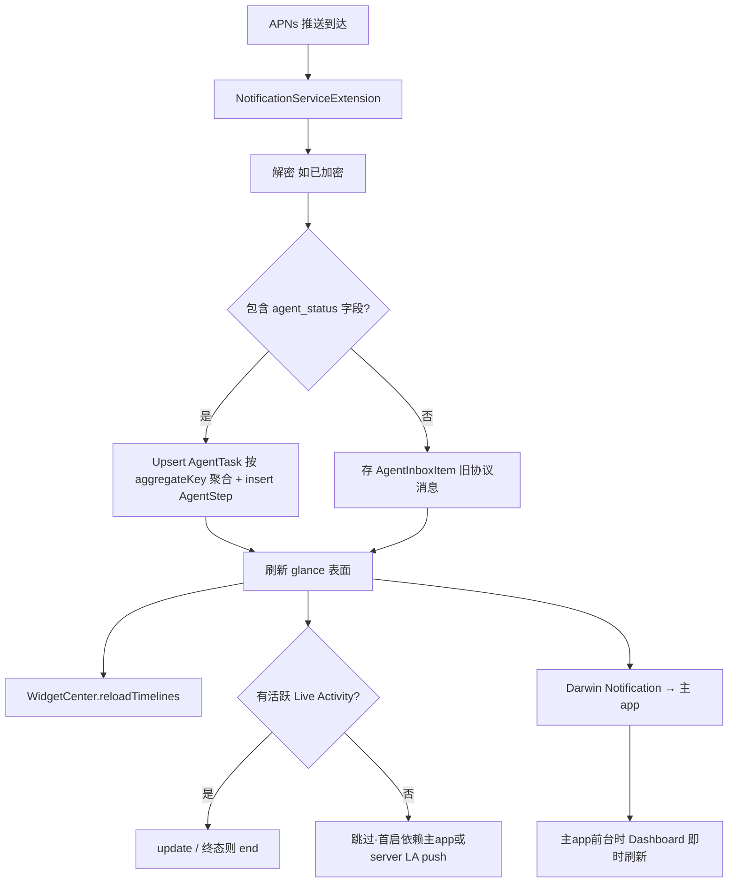
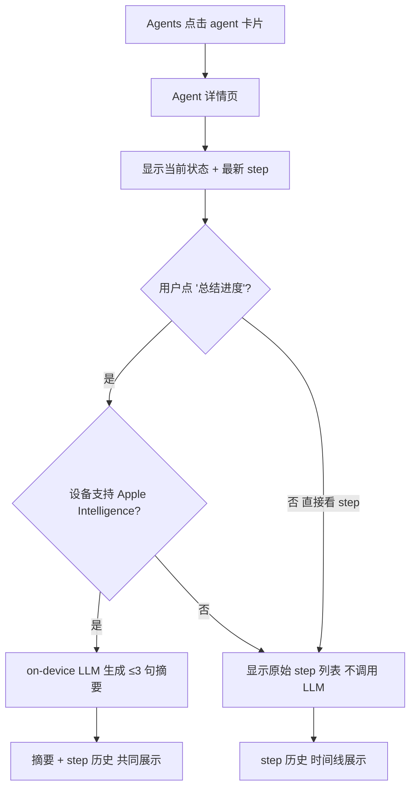

# BarkAgent — 产品规格说明

> 版本: 0.5.0 | 日期: 2026-07-22 | 状态: Draft（glance-first 价值重定框）

## 0. 本次修订（v0.4 → v0.5）

v0.5 不是加功能，是**换重心 + 做减法**。核心动因：真实使用后确认，这个 app 的原子价值只有一句话——

> **瞄一眼：有没有 agent 需要我插手，谁还在跑。**

而现状把重心押在了「打开 app 看 dashboard」，导致三个结构性问题：

- **状态变了 UI 不动**：推送到达后数据其实已写入本地库，但唯一能"离桌看"的表面（Widget / 锁屏 / Live Activity）没被推着刷新，只能等 app 打开或 Widget 10 分钟轮询才追平。
- **History 是负债不是资产**：监控 agent 这个 job 里，用户不会回翻历史；独立 History Tab 却占着一等入口。
- **信息太多**：Search / Memo 等 Bark 收件箱血统的能力（部分已在 v0.4 下线）仍留在 IA 心智里。

v0.5 的答案：**主战场从「打开 app」搬到「不打开也能瞄」的 glance 层**，app 本体退化为「要看细节才进」的二级视图。

| 维度 | v0.4（现状） | v0.5（本次） |
|------|-------------|-------------|
| 北极星 | 打开 app 能看到 agent 状态 | **不打开也知道谁在等我插手** |
| 主战场 | App 内 Agent Dashboard | **锁屏 / Widget / Live Activity（glance 层）** |
| Tab 结构 | Agents / History / Settings（3 Tab） | **Agents / Settings（2 Tab）**，History 折进 Agents |
| 新鲜度契约 | app 打开时追平 | 推送到达即刷 glance 表面（后台/被杀也生效） |
| 最低系统 | iOS 18.0 | iOS 18.0（不变） |

> **口径声明**：v0.5 描述的是**目标形态**。Search Tab、手写 Memo 已在 v0.4 实际下线，本文按已下线事实清账，不再列为功能。

## 1. 背景

### 问题

AI Agent（Claude Code、Codex、Cursor、自建 agent workflow 等）正在成为开发者日常生产力的核心。这些 agent 往往**长时间运行在终端或后台**，开发者面临三个具体痛点：

- **状态不可见**：Agent 是在跑、在等输入、还是卡住了？除非主动切回终端，否则不知道。
- **进度看不到**：一个多步骤任务跑到第几步、还剩多少、当前在做什么——只能滚动一长串日志去找。
- **离开电脑就失联**：去开会、通勤、出门买咖啡，agent 在后台跑什么完全没感知，回来才发现早就卡在某个 confirm 提示上。

现有方案不够用：
- **Bark**：推送通道很成熟，但每条推送是孤立的消息，不聚合成"一个 agent 的状态"。开了 10 个 agent，timeline 里就是 100 条混乱的消息。
- **桌面通知**：只在电脑前有用，离开就失效。
- **Slack / Telegram bot**：能收推送但没有"agent 卡片"语义，需要自己心算"哪条是最新状态"。

### 机会

Agent 的生命周期天然是**状态机**（running / waiting / blocked / done / failed），而不是消息流。把推送通道（Bark 协议生态）和"持久 agent 卡片"语义结合，再把状态投射到 iOS 的 **glance 表面**（锁屏 / Widget / Dynamic Island），就能给开发者一个"余光里的 agent 生命体征"——不打开 app 也一眼可见，隐私不出设备。

## 2. 产品愿景

**BarkAgent 是你余光里的 AI Agent 生命体征。**

它的承诺不是"打开 app 能看到状态"，而是 **"不打开也知道谁在等我插手"**。

三层价值，重心整个下移到 glance 层：

| 层 | 场景 | 表面 | 承诺 |
|----|------|------|------|
| **L0 Glance**（主战场） | 离桌·锁屏/Widget/Dynamic Island | 系统级 glance surface | 状态变化即刻可见，无需打开 app |
| **L1 Triage**（打开第一屏） | 在桌·快速分诊 | Agents Dashboard 三桶 | 一屏分清 needs-you / running / settled |
| **L2 Detail**（要看细节才进） | 深入某个 agent | Agent 详情 + step 历史 | 展开原始推送流，按需设备端 LLM 摘要 |

设计原则：
- **Glance 优先**：产品的成败在锁屏那一眼，不在 app 内页面的丰富度。
- **状态机优先于消息流**：UI 围绕"agent 状态"组织，不是"消息列表"。
- **隐私优先**：所有数据存设备本地，总结用 Apple Intelligence on-device，不上传不分析。
- **Bark 协议兼容**：Agent 接入零门槛——任何能发 HTTP 的 agent / hook / CI 都能推。
- **做减法**：不是消息收件箱。Search / 手写 Memo 等收件箱血统不进 v0.5 主路径。

## 3. 目标

| 目标 | 衡量标准 |
|------|----------|
| **离手即时感知** | 关键状态变化（blocked / failed / waiting_input）在推送到达后 glance 表面（锁屏 / Widget / Live Activity）即刻更新，**不依赖 app 处于前台** |
| Agent 状态一眼可见 | 打开 Agents 首屏，同屏可分清「需要我插手 / 还在跑 / 已了结」三桶 |
| 接入零摩擦 | 已有 Bark hook 的 agent 无需改代码即可接收；带 `agent_status` 等新字段则升级为状态卡片 |
| 进度压缩可读 | 多步骤 task 的 step 历史可一键总结为 ≤3 句话的进度摘要（设备端 LLM，按需触发） |
| 默认隐私 | 总结全部 on-device，除 APNs 注册和 Bark 服务器通信外无网络请求 |

## 4. 非目标 (V1)

- **远程控制 agent**：BarkAgent 只读不写，不发送指令给 agent（V2 考虑双向通道）
- **消息收件箱语义**：不是 Bark 的替代收件箱；不做手写备忘录、不做全文 Search Tab（v0.4 已下线，v0.5 不回收）
- **Agent 编排 / workflow 设计**：不是 n8n 替代品，不画 DAG
- **跨设备同步**：所有数据本地（V2 考虑 iCloud 私有同步）
- **设备端存储加密**：依赖 iOS Data Protection，V2 上 SQLCipher
- **Android / iPad 专属布局**：仅 iOS iPhone（iPad 可用但不优化）
- **付费 / 订阅 / 账号系统**

## 5. 目标用户

### 主要用户：跑 AI Agent 的开发者

- 日常使用 Claude Code / Codex / Cursor / Aider / 自建 agent
- 在 agent 的 hook 系统（如 Claude Code 的 SessionStart / Stop / SubagentStop hook）里写过推送脚本
- 同时跑多个 agent / 多个任务，需要全局视图
- **离开电脑时仍希望瞄一眼 agent 状态**——这是 v0.5 的核心场景
- 已经熟悉 Bark 或类似 HTTP 推送工具

### 次要用户：自动化爱好者 / CI 重度用户

- 跑 GitHub Actions / GitLab CI / 本地 cron / n8n workflow
- 希望把"长跑任务的状态"以卡片形式聚合到一个地方
- 之前用 Bark 接收 CI 通知，但苦于消息太散

## 6. 用户场景

### 场景 1：开发者 — 离桌瞄一眼（v0.5 核心场景）

林在终端同时跑了 4 个 Claude Code 会话，去会议室开会。她**没有打开 app**——只是拿起 iPhone 瞄了眼锁屏：

- 锁屏 Widget 显示 `2 wait · 1 run · 1 done`
- Dynamic Island 里 `test-writer` 的 Live Activity 亮着黄色 `[ WAIT ]`

她知道有一个 agent 在等她确认。掏出电脑切回去回一个 "yes"，整个过程没打开 BarkAgent。

### 场景 2：CI 重度用户 — 长任务进度感知

Alex 的 monorepo 每次 deploy 要 25 分钟，CI 在不同阶段（lint / typecheck / build / test / migrate / deploy）各推一条 Bark 消息。整个 deploy 是**一张卡片 + 一个 Live Activity**，状态从 `running 1/6` 一直更新到 `done 6/6`，他在地铁上看一眼锁屏就知道现在到哪步、有没有挂。

### 场景 3：自建 agent workflow — 失败告警

李用 n8n 跑数据抓取 workflow。某个 node 失败时 n8n 的 error hook 推一条 `agent_status=failed`，BarkAgent **在推送到达的那一刻**就把锁屏 Widget 对应卡片刷成红色、闭合 Live Activity 并触发显著通知。他不用打开 app 就知道哪个 workflow 挂了。

## 7. 核心功能

### 7.1 Glance 层（L0 · 主战场）

这是 v0.5 的重心。让"在跑 / 需插手的 agent"成为锁屏一等公民。

- **状态摘要 Widget（小）**：全局 `N needs-you · M running · K settled` 计数，配色对应状态。
- **Active Agents Widget（中）**：计数 + 最近一个 needs-you agent 名 + status code + 最新 step。
- **锁屏 Widget**：needs-you / running 计数摘要。
- **Live Activity & Dynamic Island**：
  - `waiting_input` / `blocked` 的 agent → 起一个 Live Activity（最需要用户注意的状态）
  - Dynamic Island 显示：agent 名 + status code + 进度
  - 状态转 `done` / `failed` / `running` / `stale` / 用户归档 → 闭合对应 Live Activity
- **新鲜度契约（关键）**：推送到达 NotificationServiceExtension 后，**立即**刷新 glance 表面（`WidgetCenter.reloadTimelines` + Live Activity update），不等主 app 唤醒。
  - 约束：NSE 自身无法 `Activity.request` 启动新 Live Activity（系统限制），首次启动依赖主 app 在前/后台运行或服务器端 LA push。详见 design.md 线 C。

### 7.2 Agent Dashboard（L1 · 打开第一屏）

- **三桶 triage**：
  - **Needs you**：`waiting_input` / `blocked`（顶部大卡，最醒目）
  - **Running**：`running`
  - **Settled**：`done` / `failed` / `stale`
- **按 project 分组折叠**：相同 agentID 的多 session 聚成一个 project 组，可折叠（v0.4 已落地）。
- **顶部 heads-up 面板**：全局三桶计数概览。
- **History 折入 Agents（v0.5 变更）**：已了结 / 已归档的 task 不再是独立 Tab，而是 Agents 内 `Settled` 桶 + 展开区。旧协议消息（`AgentInboxItem`）归入其中。
- **卡片操作**：置顶 / 归档 / 静音 / 标记完成。
- **Darwin 刷新**：NSE 写库后发 Darwin Notification，主 app 前台时 Dashboard 即时刷新。

### 7.3 Agent 状态机模型

V1 最关键的产品差异化点。

- **聚合规则**：相同 `agent_id + task_id` 的多次推送 → 更新同一张卡片（`aggregateKey = "<agentID>::<taskID-or-_>"`），不堆消息。每次推送插入一条 `AgentStep` 作为历史。
- **状态枚举**（来自推送字段 `agent_status`）：`running` / `waiting_input` / `blocked` / `done` / `failed`
- **状态转换**：客户端不强制状态机合法性，完全信任 agent 推送的状态值（agent 是事实来源）。
- **Stale 降级**：`running` 超过可配阈值（**默认 15 分钟**，`StaleTimeoutStore` 可调）无更新 → 派生为 `stale`（视觉灰化）。**这是渲染时按 now 惰性计算的派生态**（`effectiveStatus`），不落库覆盖原始 status。
  - **实现备注**：真身 `StaleThresholdCatalog` 选项为 `[off,10,30,60,120]` 且默认 30。落地 v0.5 需插入 `.minutes(15)` → `[off,10,15,30,60,120]` 并把 `defaultThreshold` 改为 `.minutes(15)`（G 阶段代码任务）。
- **历史展开**：点开卡片 → 看到这个 task 的所有 step 推送（按时间序）。

### 7.4 Agent 详情（L2 · 要看细节才进）

- 当前状态 + 进度 + ETA
- Step 历史时间线（原始推送展开）
- **设备端 LLM 进度总结（P1，按需触发）**：用户点"总结进度"才调用 FoundationModels（iOS 18.1+ + 支持机型），≤3 句中文摘要 + 阻塞点；不支持设备隐藏按钮，降级为原始 step 列表；结果缓存（默认 5 分钟）。
- 操作：归档 / 静音 / 标记完成。

### 7.5 Bark 协议兼容（传输层）

V1 完全复用 Bark 推送协议作为接入层，零成本生态兼容。

- Agent / hook 推送方式：`curl -X POST https://<bark-server>/<key> -d '...'`
- **字段映射**（向下兼容 Bark 老协议）：
  - `group` → `agent_id`（缺省则用 `default`）
  - `title` → 当前 step 名 / 状态描述
  - `body` → 详细 log
  - `url` → 可选外链（如 CI 构建页）
  - `icon` → agent 图标
- **新增可选字段**（不带也能用，带了体验升级）：
  - `agent_status`: `running` / `waiting_input` / `blocked` / `done` / `failed`
  - `task_id`: 任务唯一 ID（多 task 并发时区分；缺省则按 `agent_id` 聚合）
  - `progress`: 字符串，如 `3/7` 或 `45%`
  - `eta`: ISO 时间戳，预计完成时间
- **协议降级**：不带 `agent_status` 的推送 → 落入 `AgentInboxItem`（`[ BARK ]` 徽章），归入 Agents 的 Settled/历史区，不影响存量 Bark 用户。
- **继承能力**（来自原 Bark）：密文解密（AES-128/192/256，CBC/ECB/GCM）、Markdown 渲染、中断级别（active / timeSensitive / passive / critical）、Badge / 自动复制 / 分组静音 / 图片附件 / 自定义图标、per-status 提示音。
- **多服务器**：同时连接多个 Bark 服务器。

### 7.6 隐私与安全

- 数据存 SwiftData 应用沙箱（App Group 共享给 NSE / Widget）。
- 无分析 / 无遥测 / 无数据收集。
- 除 APNs 注册和 Bark 服务器通信外无网络请求。
- LLM 摘要 prompt 显式 strip server URL / key / auth header。
- 上架必备之外的安全项（Encryption 区块 / SQLCipher / 生物识别锁）**不做**（历史决策）。

## 8. 信息架构（v0.5）

```
BarkAgent
├── L0 Glance（系统级，非 app 内）
│   ├── 状态摘要 Widget（小 / 中）
│   ├── 锁屏 Widget
│   └── Live Activity / Dynamic Island
│
├── Agents Tab（主 Tab · L1）
│   ├── 全局 heads-up 计数（needs-you · running · settled）
│   ├── Needs you 段（大卡）
│   ├── Running 段（按 project 分组折叠）
│   ├── Settled / History 段（已了结 + 归档 + 旧协议消息）
│   └── Agent 详情（L2，push 进入）
│       ├── 当前状态 + 进度 + ETA
│       ├── Step 历史时间线
│       └── 设备端 LLM 摘要（按需）
│
└── Settings Tab
    ├── 接入向导（Setup guide，deep link 可自动展开）
    ├── 服务器管理（列表 / 添加 / APNs 健康度）
    ├── 加密配置
    ├── 提示音管理（per-status）
    ├── Stale 超时阈值（默认 15 分钟）
    ├── 通知偏好
    └── 关于 / 隐私（Analytics off + Privacy policy 链接）
```

> **相对 v0.3 的 IA 变化**：Search Tab 删除（v0.4）；手写 Memo 删除（v0.4，`AgentInboxItem` 仅承载旧协议 incoming 消息）；History 从独立 Tab 折入 Agents（v0.5）；最终 **2 Tab**。

## 9. 用户流程

### 9.1 接收 Agent 推送（含 glance 即时刷新）


```mermaid
flowchart TD
    A[APNs 推送到达] --> B[NotificationServiceExtension]
    B --> C[解密 如已加密]
    C --> D{包含 agent_status 字段?}
    D -->|是| E[Upsert AgentTask 按 aggregateKey 聚合 + insert AgentStep]
    D -->|否| F[存 AgentInboxItem 旧协议消息]
    E --> G[刷新 glance 表面]
    F --> G
    G --> H[WidgetCenter.reloadTimelines]
    G --> I{有活跃 Live Activity?}
    I -->|是| J[update / 终态则 end]
    I -->|否| K[跳过·首启依赖主app或server LA push]
    G --> L[Darwin Notification → 主 app]
    L --> M[主app前台时 Dashboard 即时刷新]
```

### 9.2 查看 Agent 进度（L2）


```mermaid
flowchart TD
    A[Agents 点击 agent 卡片] --> B[Agent 详情页]
    B --> C[显示当前状态 + 最新 step]
    C --> D{用户点 '总结进度'?}
    D -->|是| E{设备支持 Apple Intelligence?}
    E -->|是| F[on-device LLM 生成 ≤3 句摘要]
    E -->|否| G[显示原始 step 列表 不调用 LLM]
    D -->|否 直接看 step| G
    F --> H[摘要 + step 历史 共同展示]
    G --> I[step 历史 时间线展示]
```

## 10. V1 范围与优先级

### P0 — 必须有

- **Glance 新鲜度**：NSE 推送到达即 `reloadTimelines`（治"状态变 UI 不动"的最小闭环）
- **Live Activity 本地链**：app 前/后台运行时，needs-you agent 自动起 Live Activity + Dynamic Island 实时更新 + 终态闭合（NSE 可 update 已存在 LA）
- **2 Tab IA 瘦身**：History 折入 Agents；确认 Search / Memo 下线不回收
- Agent Dashboard 三桶 triage + project 分组折叠
- Agent 状态机模型（聚合 / 状态枚举 / stale 派生）
- Bark 协议兼容接收（含新字段解析 + 老协议降级）
- 多服务器管理 + APNs 注册
- 推送端到端加密（Bark AES）
- Agent 详情页（step 历史展开）
- 置顶 / 归档 / 静音
- 推送通知系统级展示 + per-status 提示音

### P1 — 应该有

- **Live Activity 远程冷态更新**：app 被系统完全杀掉时，靠服务器 `liveactivity` push 直接更新锁屏 LA（依赖 BarkMateServer LA push 端点，跨端）
- 设备端 LLM 进度总结（FoundationModels，iOS 18.1+）

### P2 — 锦上添花

- Siri Shortcuts（查询 active 计数）
- 导出（JSON / ZIP）
- 二维码服务器配置

## 11. 路线图

| 版本 | 功能 |
|------|------|
| V1.0 | **Glance 新鲜度** + **Live Activity 本地链** + 2 Tab 瘦身 + Agent Dashboard 三桶/分组 + 状态机 + Bark 兼容接收 + 详情页 |
| V1.1 | Live Activity 远程冷态更新（Server LA push）+ 设备端 LLM 总结 |
| V2.0 | 双向通道（向 agent 发指令）、SQLCipher 加密、iCloud 私有同步 |
| V2.x | 自定义 agent 模板、多 task 依赖图视图 |
| V3.0 | Apple Watch 伴侣（手腕看 agent 状态）、跨设备同步 |

## 12. 技术约束

- **iOS 18.0+** 最低部署目标（project.yml 现状）；Apple Intelligence 特性要求 iOS 18.1+ + 支持机型，按 `@available` 自适应降级。
- **SwiftUI + SwiftData**——不引入 UIKit（边缘手势等零星桥接除外）/ Realm / RxSwift。
- **Swift Concurrency**——async/await、actor、strict sendability（`SWIFT_STRICT_CONCURRENCY: complete`）。
- **FoundationModels**（iOS 18.1+）做 on-device 摘要；不支持时降级为原始列表。
- **ActivityKit**做 Live Activity；NSE 不能启动 Activity，首启依赖主 app 或 server LA push。
- **WidgetKit**——glance 层核心；NSE 触发 `reloadTimelines` 保证新鲜度。
- **最小依赖**——优先 Apple 框架；现用 Factory（DI）+ swift-markdown-ui。
- **App Groups**——NSE / Widget ↔ 主 app 共享 SwiftData store 必需。
- **模块化架构**——Swift Packages：Models / BarkService / Store / DesignSystem。
